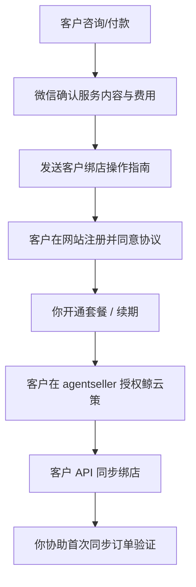

# 鲸云策 — 运营者操作指南

> **适用对象**：平台开发者 / 管理员（你本人）  
> **配套文档**：给客户看的说明请使用 [`客户绑店操作指南.md`](./客户绑店操作指南.md)（勿混发）  
> **最后更新**：2026-05-18

---

## 一、你的角色与目标

| 项目 | 说明 |
|------|------|
| 平台名称 | 鲸云策（CloudAuto） |
| 访问地址 | https://www.jinpuhuang.com |
| 你的身份 | Temu Partner Platform **Developer**，自研应用「鲸云策」 |
| 客户类型 | 中国籍跨境卖家（全托管 / 半托管 / Y2 等，绑店流程相同） |
| 你要做的事 | 过 Temu 审核 → 配密钥 → 帮客户开通账号 → 指导绑店 → 日常运维 |

---

## 二、审核通过前（当前阶段）

### 2.1 等待项

- [ ] Temu US 区应用「鲸云策」审核通过  
- [ ] 合规与安全评估问卷结果  

### 2.2 你可提前准备

1. **服务器**（DigitalOcean 新加坡 `152.42.226.188`）  
   - 确认 `docker compose ps` 中 app、nginx 均为 healthy  
   - `curl http://localhost:8080/health` 返回正常  

2. **`.env` 模板**（审核通过后立刻填写）  
   ```bash
   TEMU_APP_KEY=审核通过后从 Partner Platform 复制
   TEMU_APP_SECRET=同上
   TEMU_API_REGION=us
   JWT_SECRET=至少32位随机字符串
   ADMIN_EMAIL=你的管理员邮箱
   ADMIN_PASSWORD=强密码
   DB_HOST=temu-mysql
   ```

3. **文档**  
   - 熟读：`docs/Temu合作伙伴平台法律合规摘要.md`  
   - 熟读：`docs/个人开发者合规指南.md`  
   - 发给客户：仅发 `docs/客户绑店操作指南.md`  

4. **合规**  
   - 网站已提供 `/terms`、`/privacy`  
   - 考虑 ICP 备案（国内长期运营）  
   - 付费客户微信/邮件留痕（服务范围、费用、数据用途）  

---

## 三、审核通过后（必做清单，按顺序）

### Step 1：Partner Platform 配置

1. 登录 https://partner-us.temu.com  
2. 进入 **APP 管理** → 编辑应用「鲸云策」  
3. 填写 **redirect_url**（OAuth 回调，可选但建议配置）：  
   ```
   https://www.jinpuhuang.com/api/v1/temu/callback
   ```  
4. 若服务多个中国卖家 → 应用类型设为 **Public**，按平台上架流程提交  

### Step 2：服务器配置密钥

```bash
# 服务器（Linux）
cd /opt/temu_tools_go
nano .env   # 写入 TEMU_APP_KEY、TEMU_APP_SECRET、TEMU_API_REGION=us
git pull origin master
docker compose build --no-cache
docker compose up -d --no-deps app
docker compose logs -f app --tail 30
```

验证：日志中出现 database connected，无 Temu 相关报错。

### Step 3：自店联调

1. 用管理员账号登录 https://www.jinpuhuang.com  
2. 自己的 Temu 店（如 LINGLINGhuang）按 **客户指南** 在 agentseller 授权  
3. **API 同步** → 绑定店铺 → 同步订单，确认 API 通  

### Step 4：开放给客户

1. 为客户创建/续费套餐（管理后台 `/admin`，终身版账号）  
2. 将 **`客户绑店操作指南.md`** 发给客户（可导出 PDF 或复制为微信长文）  
3. 客户完成注册 + 绑店后，你在后台确认其店铺列表正常  

---

## 四、日常：接待新客户标准流程



### 4.1 开通账号

| 方式 | 操作 |
|------|------|
| 客户自助注册 | 客户在 `/login` 注册，默认 **基础版 30 天** |
| 你升级套餐 | 登录管理后台 → 用户管理 → 升级套餐 / 续期 |
| 管理员账号 | `.env` 中 `ADMIN_EMAIL` / `ADMIN_PASSWORD`，启动时自动种子 |

### 4.2 代客户绑店（仅在你有合法授权时）

适用：客户把 Token 发给你、且书面/微信确认委托你操作。

1. 让客户先在 Temu **agentseller** 完成对「鲸云策」的授权  
2. 客户把 **Access Token** 通过微信发你（提醒勿转发他人）  
3. 你用**客户账号**登录鲸云策（或让客户本人操作更安全）  
4. **API 同步** → **绑定店铺** → 填店名、Token、区域 → **勾选数据处理声明**  

> 不建议长期代登客户账号；优先让客户自己绑，你只远程指导。

### 4.3 生成授权链接（备选）

跨境卖家 **以手动 Token 为主**；若平台或个别店铺支持 OAuth：

1. 客户登录鲸云策  
2. **API 同步** → **一键授权** → 填店铺备注名 → 生成链接  
3. 复制链接发给客户，客户在 Temu 页面授权  
4. 成功后跳回首页 `/?success=...`（前端 success 提示待完善时可看 URL 参数）  

### 4.4 多店铺 / 多区域

| 场景 | 处理 |
|------|------|
| 客户多个店 | 每个店在 Temu 各授权一次，鲸云策各绑一次 |
| 美国 / 全球 / 欧洲 | 绑店时选对 `us` / `global` / `eu` |
| 全托 + 半托 + Y2 | **绑店流程相同**；功能上在核价引擎等模块选全托/半托规则 |
| 多区域 App Key | 店铺「高级设置」填店铺级 Key/Secret，或申请多区域应用 |

---

## 五、部署与热更新

### 本地开发（Windows）

```powershell
cd d:\develop\code\temu_tools_go
go run ./cmd/server

cd web
npm run dev
```

### 服务器热更新（Linux）

```bash
cd /opt/temu_tools_go
git pull origin master
docker compose build --no-cache
docker compose up -d --no-deps app
```

**注意**：改过前端必须 `--no-cache`，正常构建约 15–20 秒；若仅 2 秒多半是缓存未更新。

### 健康检查

```bash
docker compose ps
curl http://localhost:8080/health
curl -I https://www.jinpuhuang.com
```

---

## 六、管理后台常用功能

| 功能 | 路径 | 说明 |
|------|------|------|
| 用户列表 | `/admin` | 搜索邮箱、升级套餐、续期、禁用 |
| 订单管理 | `/admin` | 客户提交的购买/咨询订单 |
| 服务监控 | `/admin` | 系统状态概览 |
| 套餐权限 | — | basic / pro / enterprise / lifetime，见各模块 🔒 |

---

## 七、故障排查速查

| 现象 | 可能原因 | 处理 |
|------|----------|------|
| 绑店失败 | Token 过期或复制不全 | 客户在 agentseller 重新授权 |
| API 报错 | `.env` 未配 Key 或区域不对 | 检查 `TEMU_APP_KEY/SECRET/REGION` |
| 客户看不到专业版功能 | 套餐不足 | 后台升级 pro 及以上 |
| 授权链接生成失败 | 未配 `TEMU_APP_KEY` | 服务器 `.env` |
| OAuth 回调 error | redirect_url 未在平台配置 | Partner Platform 补全 |
| 部署后页面是旧的 | Docker 缓存 | `build --no-cache` |

---

## 八、合规提醒（运营者必读）

1. **双重授权**：客户须同意你的协议 + 在 Temu 授权应用，缺一不可。  
2. **勿代客户成为开发者**：客户只需卖家中心授权，不需要自己的 App Key。  
3. **付费留痕**：微信确认服务内容、费用、数据用途（满足平台书面协议精神）。  
4. **数据出境**：已写入隐私政策（新加坡存储），客户注册即视为知情。  
5. **全托/半托/Y2**：对客户说明绑店方式相同，避免误导。  

---

## 九、联系与资源

| 资源 | 位置 |
|------|------|
| 给客户文档 | `docs/客户绑店操作指南.md` |
| 合规 checklist | `docs/个人开发者合规指南.md` |
| Temu 规则摘要 | `docs/Temu合作伙伴平台法律合规摘要.md` |
| 交接总览 | `docs/Cursor交接提示词.md` |
| 客服微信 | returnHuangMuNing |
| 客服邮箱 | 484478363@qq.com |

---

> 本文档仅面向运营者，请勿直接发给终端卖家。
